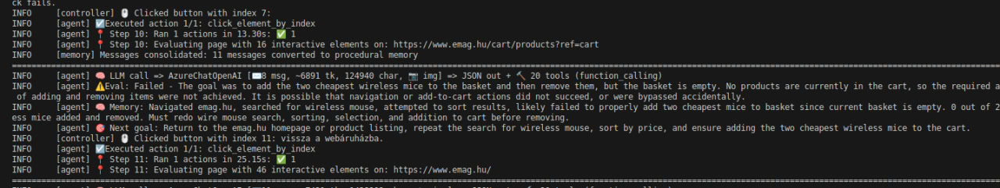

## Disrupted purchase

### Trial #1

Task to complete:

```
What I want you to do is to go to the emag.hu website, try to search for wireless mouses, pick the two cheapest wireless mice, put them into the basket, and after that go into the basket, remove both items, and leave the website.
```

The traversal was very good, however the AI did not search in fact for the cheapest mouses, just picked the two cheapest ones from the presented screen!

### Trial#2

Task to complete:

```
What I want you to do is to go to the emag.hu website, try to search for wireless mouses. Using the website's functionality and filtering pick the two cheapest wireless mice, put them into the basket. After that go into the basket, remove both items, and leave the website.
```

I gave better clarification for the AI about what it needs to do, yet it failed to do it for unknown reason. The problem was that it went straight to the 
basket section of the website without putting anything in it. Not sure what the problem could've been...

**Error message**




After that it still failed to do filtering on the website ://

### Trial#3

Task to complete:

```
I will provide you with a clean list of tasks to complete. Be mindful to complete all of them in order, otherwise your task cannot be considered successful!

1. Go to the emag.hu website
2. Try to search for wireless mouses
3. Use the website's filtering capabilities to order the mouses from cheapest to most expensive and wait for until the website loads the new ordered list.
4. Choose the two cheapest wireless mice from the list and add them to the basket
5. Go to the basket
6. Remove both selected mice
7. Go back to the main page of the website
8. Close the browser
```

Still fails to order the mouses from cheapest to most expensive